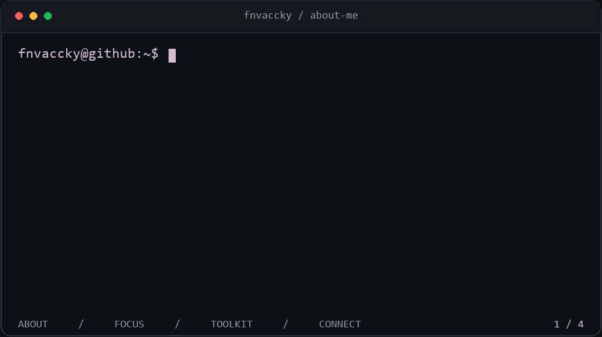

### A little about me

I'm **Achilles Asuncion**, also known as **fnvaccky** — a college student, frontend developer, and lifelong learner.

I enjoy building modern, responsive, and interactive web experiences. Along the way, I share what I learn and help fellow coders grow with me.

### Languages & tools

### Studying

Expanding my toolkit and learning how to build better projects.

### Other tools & platforms

### What I'm up to

- 🔭 Improving my frontend projects.
- 🌱 Learning frontend best practices and exploring new tools.
- 👯 Looking to collaborate on web projects with fellow developers.
- 🤝 Learning from others and sharing what I discover.
- 💬 Happy to talk about what I'm building or learning.

### What I'm building

🏋️ **[Form Fitness](https://github.com/fnvaccky/form-fitness)**  
A gym membership management project.

[Explore my repositories →](https://github.com/fnvaccky?tab=repositories)

### Let's connect

Have an idea, want to collaborate, or just want to talk about coding? Let's connect and learn together!

---

  <i>Still learning. Still building. Sharing along the way.</i>

